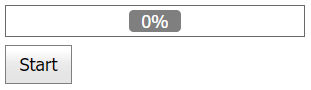

# Progress Bar for ASP.NET Web Forms - How to use the WebMethod attribute to display the progress of a server-side process on the client
<!-- run online -->
**[[Run Online]](https://codecentral.devexpress.com/t156786/)**
<!-- run online end -->

This example demonstrates how to use the [WebMethod](https://learn.microsoft.com/en-us/previous-versions/visualstudio/visual-studio-2008/byxd99hx(v=vs.90)?redirectedfrom=MSDN) attribute to get information about the current progress from the server and display it on the client without refreshing the whole page. To enable this functionality, use the *jQuery library* or *ScriptManager* page.



## Overview

Add the WebMethods attribute to the **BasePage** class as follows:

```cs
[WebMethod(EnableSession = true)]
```

For the jQuery approach, send a `POST` request to the WebMethod:

```js
function WebMethodRequest(url, callback) {
    $.ajax({
        url: url,
        type: "POST",
        contentType: 'application/json; charset=utf-8',
        success: callback
    });
}
```

For the ScriptManager technique, call the `StartOperation` method:

```js
function callbackStart(s, e) {
    // ...
    PageMethods.StartOperation();
    // ...
}
```

## Files to Review

* [BasePage.cs](./CS/App_Code/BasePage.cs) (VB: [BasePage.vb](./VB/App_Code/BasePage.vb))
* [Operation.cs](./CS/App_Code/Operation.cs) (VB: [Operation.vb](./VB/App_Code/Operation.vb))
* [Default.aspx](./CS/Default.aspx) (VB: [Default.aspx](./VB/Default.aspx))
* [Default.aspx.cs](./CS/Default.aspx.cs) (VB: [Default.aspx.vb](./VB/Default.aspx.vb))
* [jQuery.aspx](./CS/jQuery.aspx) (VB: [jQuery.aspx](./VB/jQuery.aspx))
* [jQuery.aspx.cs](./CS/jQuery.aspx.cs) (VB: [jQuery.aspx.vb](./VB/jQuery.aspx.vb))
* [ScriptManager.aspx](./CS/ScriptManager.aspx) (VB: [ScriptManager.aspx](./VB/ScriptManager.aspx))
* [ScriptManager.aspx.cs](./CS/ScriptManager.aspx.cs) (VB: [ScriptManager.aspx.vb](./VB/ScriptManager.aspx.vb))

## Documentation

* [How to call WebMethod?](https://stackoverflow.com/questions/9854006/how-to-call-webmethod)
* [Expose Web Services to Client Script](https://learn.microsoft.com/en-us/previous-versions/aspnet/bb398998(v=vs.100)?redirectedfrom=MSDN)

## More Examples

* [How to display the progress of a server-side process on the client](https://github.com/DevExpress-Examples/how-to-display-progress-information-about-server-side-callback-processing-e918)
